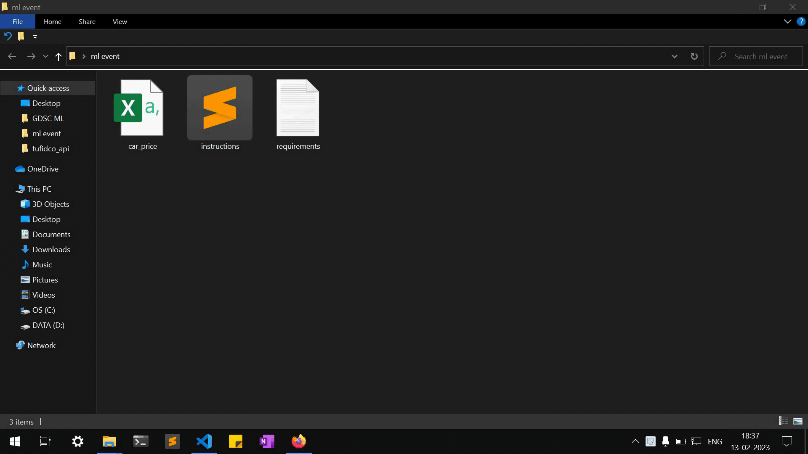

# Hello there

### Kindly follow these instructions before coming to the event tomorrow :smile:

- Unzip the given zip file into any destination
- Go into the folder and you will find the following files

- Open command prompt in that location

- Type ``pip install -r requirements.txt``
- To start jupyter notebook, type ``jupyter notebook``

Looking forward to see you guys tomorrow!